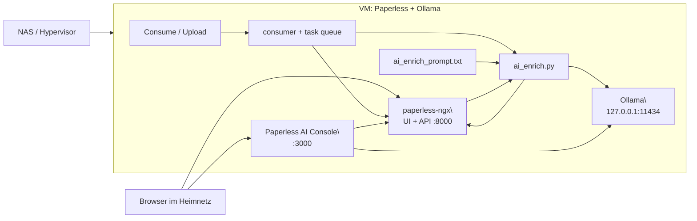

# Architecture

## Ueberblick

Hinweis:

- diese Datei beschreibt das allgemeine Zielbild
- die realen NAS-Runtime-Erkenntnisse fuer Intel Iris Xe, `ollama` und `llama.cpp` stehen zusaetzlich in [NAS_RUNTIME_FINDINGS.md](NAS_RUNTIME_FINDINGS.md)

Das System besteht in diesem Setup aus zwei Infrastrukturebenen und mehreren lokalen Diensten:

1. NAS / Hypervisor
2. VM mit `paperless-ngx`, `Ollama` und der lokalen Glue-Logik

## Reale Topologie

```text
+--------------------------------------------------------------+
| NAS / Hypervisor                                             |
|                                                              |
|  - hostet die VM                                             |
|  - optional: Docker / Open WebUI ausserhalb der VM           |
+------------------------------+-------------------------------+
                               |
                               | virtueller Server
                               v
+--------------------------------------------------------------+
| VM: Paperless + Ollama                                       |
|                                                              |
|  Paperless-ngx                                               |
|  - webserver.service      -> UI + API auf :8000             |
|  - consumer.service       -> importiert neue Dokumente      |
|  - task-queue.service     -> Celery-Tasks                   |
|  - scheduler.service      -> periodische Tasks              |
|                                                              |
|  KI-Schicht                                                  |
|  - /opt/paperless/ai_enrich.py                              |
|  - /opt/paperless/ai_enrich_prompt.txt                      |
|  - /opt/paperless/ai_backfill.py                            |
|                                                              |
|  Ollama                                                      |
|  - API lokal auf 127.0.0.1:11434                            |
|  - Modelle z. B. qwen3.5:9b / qwen3.5:4b                    |
|                                                              |
|  Webkonsole                                                  |
|  - ollama-web.service -> Port 3000                          |
|  - Chat, Review, Prompt, Modellsteuerung, Backfill          |
+--------------------------------------------------------------+
```

## Mermaid-Uebersicht



## Was laeuft wo

### NAS / Hypervisor

- hostet die VM
- stellt CPU, RAM und Storage bereit
- kann optional weitere Container oder Dienste ausserhalb der VM betreiben

### VM

- fuehrt `paperless-ngx` aus
- fuehrt `Ollama` lokal aus
- fuehrt die Port-`3000`-Steuerkonsole aus
- enthaelt Prompt, Hook und Backfill-Skripte

## Netzsicht

```text
Browser
  -> http://<vm-ip>:3000   Paperless AI Console
  -> http://<vm-ip>:8000   Paperless UI / API

Innerhalb der VM
  -> http://127.0.0.1:11434   Ollama API
  -> http://127.0.0.1:8000    Paperless API
```

Wichtig:

- `Ollama` bleibt lokal gebunden
- Browser greifen nicht direkt auf `11434` zu
- die Webkonsole auf `3000` ist die kontrollierte Benutzeroberflaeche fuer Modelltests und Paperless-Review

## Komponenten

### Paperless

- `paperless-webserver.service`
  - UI und API
- `paperless-consumer.service`
  - beobachtet den Consume-Ordner
- `paperless-task-queue.service`
  - verarbeitet Celery-Tasks
- `paperless-scheduler.service`
  - fuehrt periodische Tasks via `celery beat` aus

### KI-Hook

- `hooks/ai_enrich.py`
  - wird nach erfolgreichem Import gestartet
  - liest das Dokument ueber die Paperless-API
  - baut aus OCR-Text und Metadaten einen Prompt
  - fragt ein lokales oder externes Modell ab
  - schreibt die vorgeschlagenen Metadaten zurueck
  - kann auf ein Fallback-Modell wechseln
  - schaltet bei `Qwen 3.5` standardmaessig Thinking aus
  - prueft Personentags gegen vorhandene Tags und OCR-Text

### Prompt-Schicht

- `prompts/ai_enrich_prompt.txt`
  - enthaelt die fachlichen Regeln fuer die Klassifikation
  - ist absichtlich vom Code getrennt
  - kann ohne Python-Aenderung angepasst werden
  - enthaelt Platzhalter fuer vorhandene Personentags

### Ollama

- lokaler API-Server auf `127.0.0.1:11434`
- Modell z. B. `qwen3.5:9b`, `qwen3.5:4b` oder `qwen2.5:7b-instruct`
- keine direkte Internetnutzung durch das Modell selbst
- kann technisch auch zusaetzliche OCR-/Vision-Modelle fuer die Review-Stufe anbinden
- eignet sich in einer CPU-VM praktisch vor allem fuer Textmodelle und bewusst begrenzte Vorschaupfade

Wichtige NAS-Erkenntnis:

- auf Intel Iris Xe ist `ollama` fuer kleine GPU-Modelle brauchbar
- fuer groessere Modelle war der Intel-Vulkan-Pfad in den Tests oft instabil oder qualitativ kaputt
- fuer stabile Qualitaet ist auf dem NAS CPU-only weiter der Referenzpfad

### Optionale zweite Runtime: `llama.cpp`

- kann als separater Docker-Dienst neben `ollama` betrieben werden
- ist fuer kompatible externe GGUFs auf dem NAS erfolgreich mit Vulkan verifiziert
- eignet sich besonders dann, wenn ein Modell ueber `ollama` auf Intel Vulkan instabil ist
- sollte als optionaler Provider gedacht werden, nicht als stiller Ersatz

### Browser-Zugriff

- `web/server.py`
  - lokaler Proxy und Browser-App fuer:
    - Chat
    - Paperless-Konfiguration
    - Prompt-Bearbeitung
    - Dokument-Review
    - Backfill
- `systemd/ollama-web.service`
  - startet die Weboberflaeche auf Port `3000`
- `scripts/paperless-ai-admin`
  - privilegierter Helfer fuer:
    - Prompt schreiben
    - `paperless.conf` aktualisieren
    - Worker neu starten
- `scripts/paperless-set-ollama-model`
  - schaltet das aktive Paperless-Modell um

## Datenfluss fuer neue Dokumente

```text
Dokument Upload / Consume
    -> paperless-consumer.service
    -> OCR/Text in Paperless gespeichert
    -> PAPERLESS_POST_CONSUME_SCRIPT
    -> ai_enrich.py
    -> Prompt + OCR + bestehende Metadaten
    -> Ollama
    -> JSON-Antwort
    -> PATCH an Paperless API
    -> Dokument ist direkt angereichert
```

## Datenfluss fuer Review im Browser

```text
Browser -> :3000
       -> web/server.py
       -> Paperless API lesen
       -> Hook-Logik als Preview
       -> Vorschlag anzeigen
       -> optional API PATCH nach Bestaetigung
```

## Datenfluss fuer experimentelle OCR-/Vision-Modelle

```text
Browser -> :3000
       -> web/server.py
       -> PDF-Seite rendern + OCR-Kontext laden
       -> minimierten Vision-/OCR-Prompt bauen
       -> lokales Ollama-Modell anfragen
       -> Ergebnis fuer Vergleich / Review anzeigen
```

Wichtig:

- dieser Integrationspfad funktioniert technisch mit mehreren Modellen
- auf einer CPU-VM ist nicht die Anbindung der Engpass, sondern die Laufzeit des multimodalen Prompts
- deshalb trennt das Projekt bewusst zwischen:
  - produktivem textbasiertem Hook
  - optionalem experimentellem Vision-Review

## Datenfluss fuer Backfill

```text
Browser -> :3000 -> Backfill starten
       -> ai_backfill.py
       -> Dokumente aus Paperless iterieren
       -> pro Dokument Hook-Logik anwenden
       -> Ergebnisse in Paperless zurueckschreiben
```

## Warum diese Trennung sinnvoll ist

- `paperless-ngx` bleibt das fuehrende System fuer Dokumente und Metadaten
- `Ollama` bleibt lokal und muss nicht direkt ins Netz
- die Webkonsole auf `3000` ist die Arbeitsoberflaeche fuer:
  - Modellwahl
  - Prompt-Aenderung
  - Einzel-Review
  - Backfill
- Hook und Backfill nutzen dieselbe fachliche Logik, damit automatische und manuelle Laeufe konsistent bleiben

## Sicherheitsmodell

- `Ollama` bleibt lokal auf `127.0.0.1:11434`
- nur die Weboberflaeche auf `3000/tcp` wird bei Bedarf nach aussen freigegeben
- API-Token liegt in `paperless.conf`, nicht im Repository
- Root-Aktionen fuer die Weboberflaeche laufen nur ueber gezielte Helper-Skripte
- `sudoers` gibt nur die benoetigten Einzelbefehle frei

## Bekannte Grenzen

- CPU-only, daher keine Hochleistungs-Inferenz
- kurze bis mittlere Prompts sind gut nutzbar, lange Laeufe sind spuerbar langsamer
- Prompt-Qualitaet bestimmt stark die Qualitaet der Tags und Titel
- paralleler Chat auf demselben `Ollama`-Dienst kann Paperless-Laeufe bremsen
- multimodale OCR-/Vision-Modelle koennen technisch korrekt eingebunden sein und dennoch fuer interaktive CPU-VM-Laeufe zu langsam bleiben
